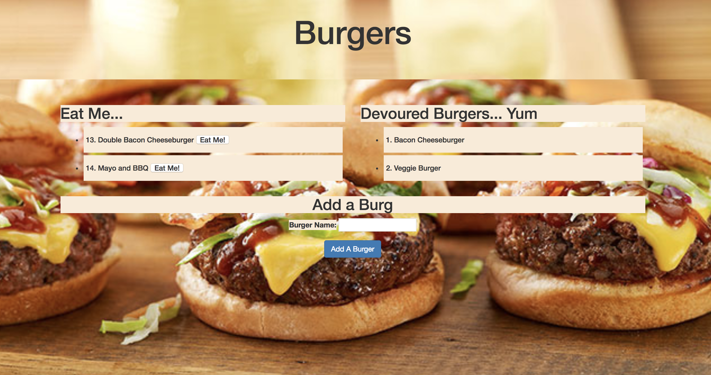
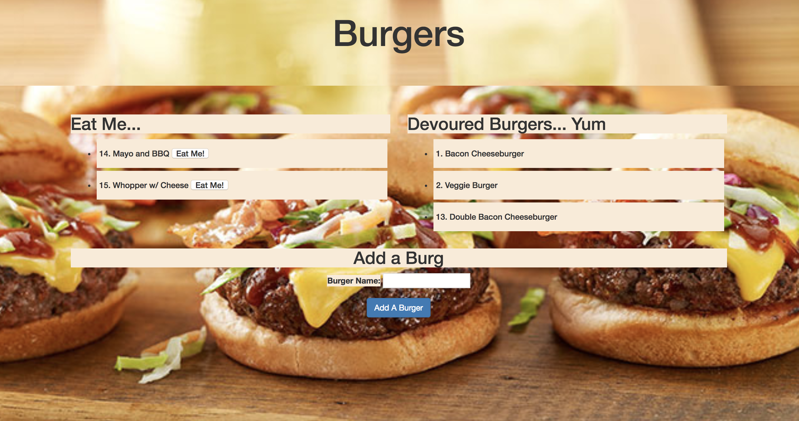

# Burger

## Welcome to Burger. Using technologies such as JavaScript, HTML, CSS, JQuery, MySQL, Node.js, MVC, and Handlebars, my Burger app allows you to keep track of burgers you would like to eat, as well as those you have eaten.  

<<<<<<< HEAD
Just type the name of the burger you want in the text box.
=======
Just type the name of the burger you want in the text box. Submit the burger and the new burger is dynamically added to your page. 
>>>>>>> c81580bfd5748e167fc469da9e671c3579cad825

Once you have eaten the burger, you can take it off your list!

